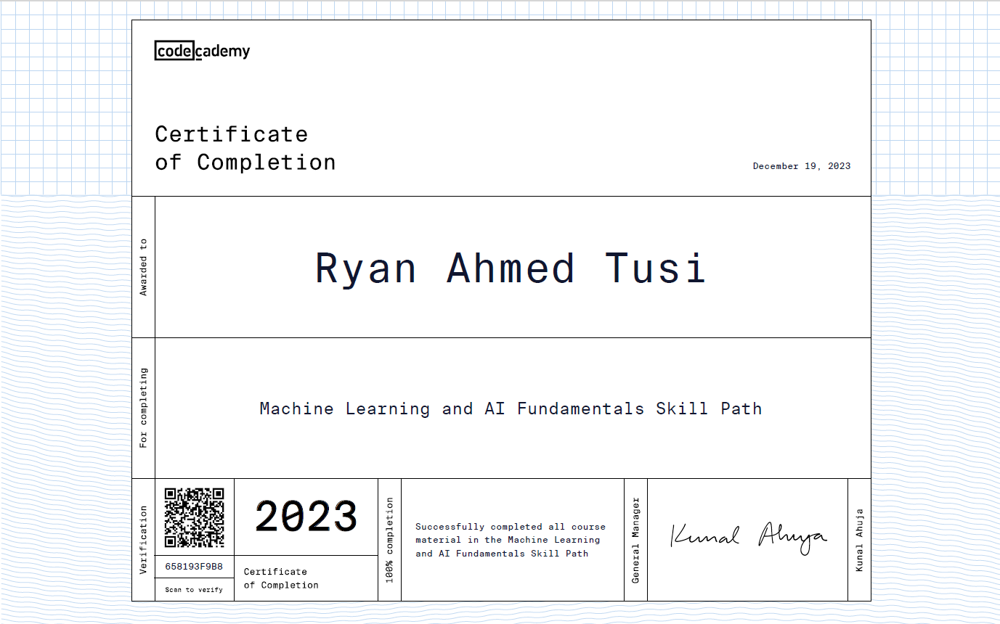

# AI/ML Foundation Course Projects

Welcome to my GitHub repository showcasing projects completed during the AI/ML Foundation course from Codecademy. This repository contains a collection of projects that demonstrate my skills and knowledge in the field of artificial intelligence and machine learning.

## Concepts Included

1. **Data Literacy Project**: An analysis of real-world datasets to understand data structures, patterns, and relationships.

2. **Python Programming Project**: Custom analyses and solutions implemented using Python programming language.

3. **Data Manipulation with Pandas**: Utilizing the Pandas library in Python to manage, clean, and manipulate data for analysis.

4. **Mathematical Foundations**: Exploring the mathematical underpinnings of machine learning algorithms and their practical applications.

5. **Statistical Analysis Project**: Leveraging statistical techniques to improve model performance and accuracy.

6. **Data Visualization**: Creating visualizations that effectively communicate insights and findings from data analysis.

## Portfolio Projects

### 1. Portfolio Medical Insurance

Description: A project focused on analyzing medical insurance data to derive insights, predict trends, and optimize insurance coverage.

Technologies Used: Python, Pandas, NumPy, Matplotlib, Scikit-Learn.

### 2. Subscriber Pipeline

Description: A project aimed at optimizing subscriber pipelines, analyzing user behavior, and improving subscription retention rates.

Technologies Used: Python, SQL, Pandas, Matplotlib, Scikit-Learn

## How to Use This Repository

Each project is organized into its respective directory, containing code files in jupyter notebooks, datasets, and documentation. You can navigate to each project's directory to view code implementations, analysis reports, and visualizations.

Feel free to explore, learn, and contribute to this repository. Your feedback and suggestions are highly appreciated!

## Certification

I have successfully completed the AI/ML Foundation course from Codecademy and earned certifications for each project showcased in this repository.

